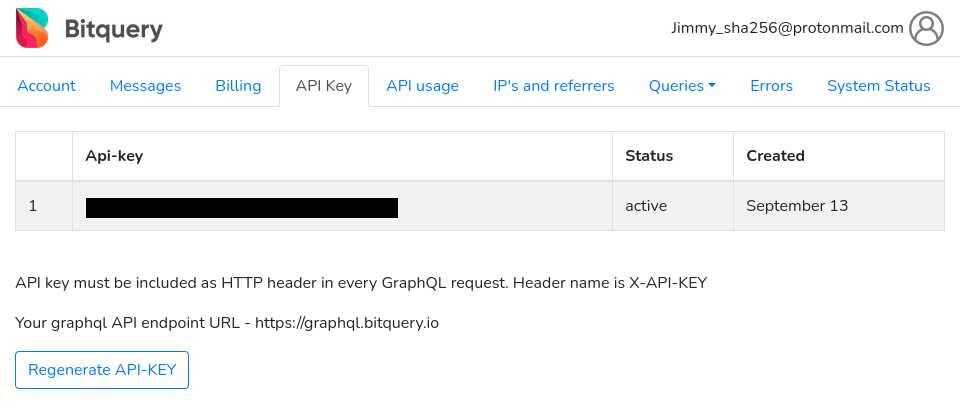
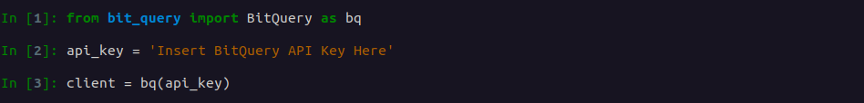
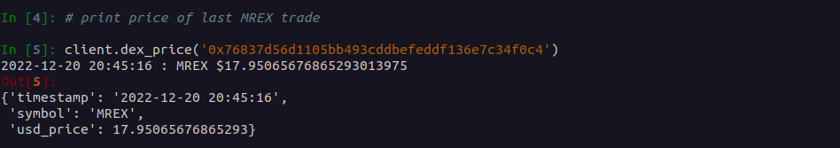
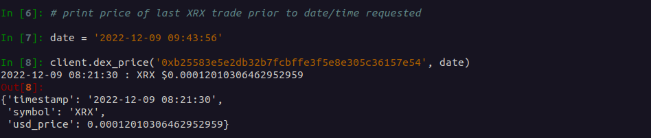
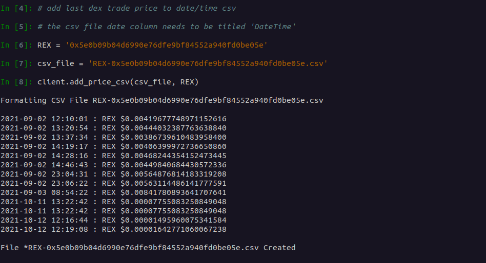

### DEX Trade Prices

This script sends a request to https://bitquery.io/ API, retriving the price data for historical DEX trades on BSC.

#### Table of Contents  
1. [Installation](#installation)
2. [Bitquery API](#bitquery_api)
3. [Create Client Object](#client_object)
4. [Last Trade Price](#last_price)
5. [Historical Trade Price](#historical_price)
6. [Add Prices To CSV File](#add_price_csv)

<a name="installation"/>

#### 1. Installation 

```shell
git clone https://github.com/Jimmy-sha256/DEX_Price_History

virtualenv --python=/usr/bin/python3.10 venv

source venv/bin/activate

pip install -r requirements.txt
```

<a name="bitquery_api"/>

#### 2. Bitquery API

Create an account: 
* https://graphql.bitquery.io/auth/signup

Generate an API Key: 
* https://graphql.bitquery.io/user/api_key





<a name="client_object"/>

#### 3. Create Client Object

```py
from bit_query import BitQuery as bq
api_key = 'Insert BitQuery API Key Here' 
client = bq(api_key)
```



<a name="last_price"/>

#### 4. Last Trade Price

```py
MREX = '0x76837d56d1105bb493cddbefeddf136e7c34f0c4'
client.dex_price(MREX)
```



<a name="historical_price"/>

#### 5. Histroical Trade Price

```py
XRX = '0xb25583e5e2db32b7fcbffe3f5e8e305c36157e54' 
date = '2022-12-09 09:43:56' 
client.dex_price(XRX, date)
```




<a name="add_price_csv"/>

#### 6. Add Prices To CSV File

```py
REX = '0x5e0b09b04d6990e76dfe9bf84552a940fd0be05e' 
csv_file = 'REX-0x5e0b09b04d6990e76dfe9bf84552a940fd0be05e.csv' 
client.add_price_csv(csv_file, REX) 
```


